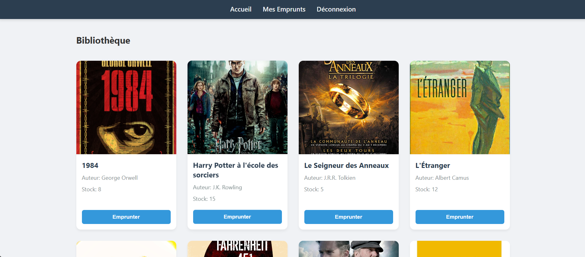
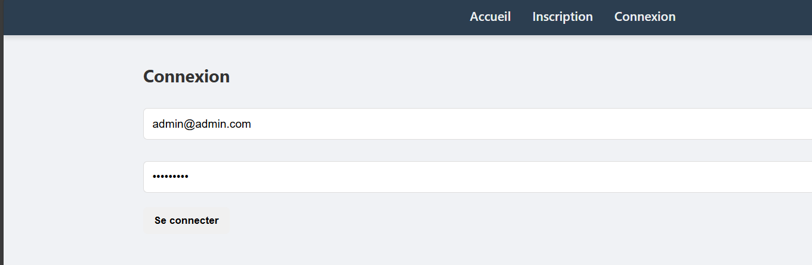
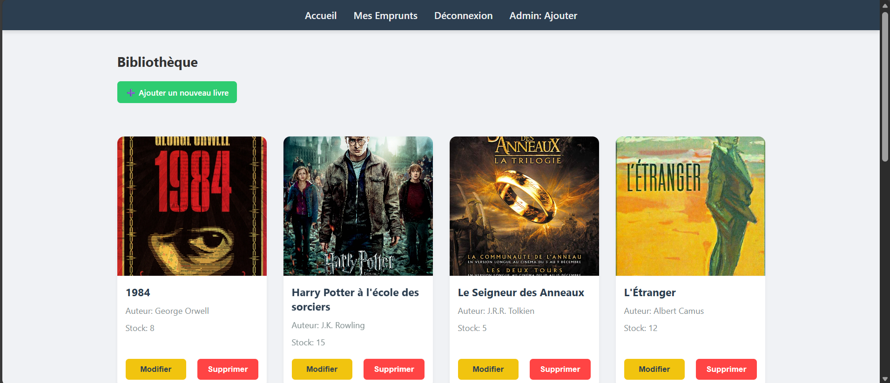
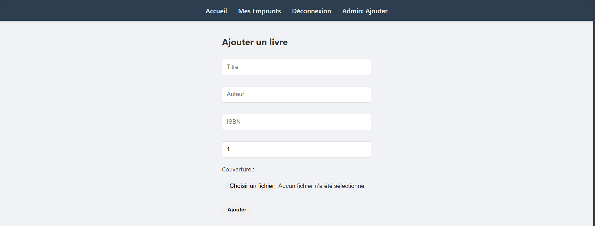

# 📚 Bibliothèque Node/Express - Guide de démarrage

Ce document explique comment installer, lancer et tester le projet (Backend & Frontend).
Il permet également d'avoir un aperçu rapide de l'application (capture d'écran à la fin).

## 📋 Prérequis

* **Docker Desktop** (installé et lancé)
* **Node.js** (version LTS recommandée)
* **PhpStorm** (recommandé pour les tests API)

---

## 🚀 1. Lancement de l'infrastructure (Docker)

Le projet utilise Docker pour la base de données (PostgreSQL), l'administration (PgAdmin) et le stockage de fichiers (MinIO).

1.  Ouvrez un terminal.
2.  Allez dans le dossier du **backend** :
    ```bash
    cd backend
    ```
3.  Lancez les conteneurs en tâche de fond :
    ```bash
    docker-compose up -d
    ```

> **Vérification** :
> * PgAdmin est accessible sur : `http://localhost:5050`
> * MinIO Console sur : `http://localhost:9001`

---

## ⚙️ 2. Démarrage du Backend

Assurez-vous d'être toujours dans le dossier `backend`.

### Installation des dépendances
*(À faire uniquement lors de la première utilisation)*
```bash
npm install

```

### Initialisation des données (Seed)

Avant de lancer le serveur, exécutez ce script pour remplir la base de données avec des livres et uploader les couvertures sur MinIO :

```bash
node seed_books.js

```

### Lancer le serveur

Pour démarrer l'API en mode développement :

```bash
npm run dev

```

*Le serveur écoutera sur `http://localhost:3001`.*

---

## 💻 3. Démarrage du Frontend

1. Ouvrez un **nouveau terminal**.
2. Allez dans le dossier du **frontend** :
```bash
cd frontend

```


3. Installez les dépendances *(si première utilisation)* :
```bash
npm install

```


4. Lancez l'application :
```bash
npm start

```


*L'application s'ouvrira automatiquement sur `http://localhost:3000`.*

---

## 🧪 4. Tester l'API

Il existe deux façons de tester les routes de l'API.

### Option A : Fichiers `.http` (Recommandé avec PhpStorm)

Des fichiers de test sont inclus dans le projet. Vous pouvez les utiliser avec l'extension "REST Client" de VS Code.

Les fichiers se trouvent dans le dossier : `backend/services/requete/`

* **Créer un compte client** : `register_client.http`
* **Se connecter** : `login_client.http`
* **Ajouter un livre (Admin)** : `create_book.http`

### Option B : Documentation Swagger

Une interface graphique est disponible pour tester les routes directement dans le navigateur :
👉 **http://localhost:3001/api/docs**

---

## Apperçu de l'application
Voici quelques captures d'écran de l'application en fonctionnement :




Ma fonction personnelle étant l'ajout d images